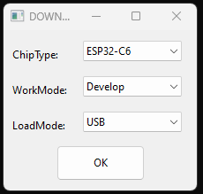
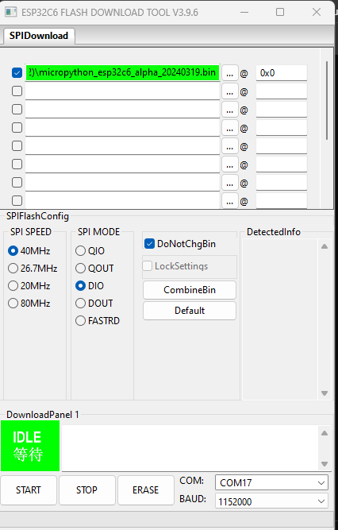

# Template ESP32 Blink Example (Esspressif ESP-IDF)

This is a template project for ESP32 using ESP-IDF. It is a simple blink example.


## Flash test firmware

Download the flasher tool from the [Espressif website](hhttps://www.espressif.com/sites/default/files/tools/flash_download_tool_3.9.6_1.zip) and flash the firmware to the ESP32.



The firmware is located in the `build` directory. The firmware is named `esp32-blink.bin`.

[ESP-Blink.bin](./build/ESP-Blink.bin)



> **Note:**
> The images are for illustrative purposes only.

The sole purpose of this template is to illustrate objectives. The firmware is a straightforward blinking example.

## Build the project

To build the project, run the following command:

```bash
idf.py build
```

## Flash the project

To flash the project, run the following command:

```bash
idf.py -p PORT flash
```

## Remember to set the correct port

The port is the USB port where the ESP32 is connected. The port is usually `/dev/ttyUSB0` or `/dev/ttyUSB1`  for Linux and `COM1`, `COM2`, etc., for Windows.

On certain development boards, it is essential to initiate boot mode by pressing the boot and reset buttons or by disconnecting and reconnecting to the PC while pressing the boot button.